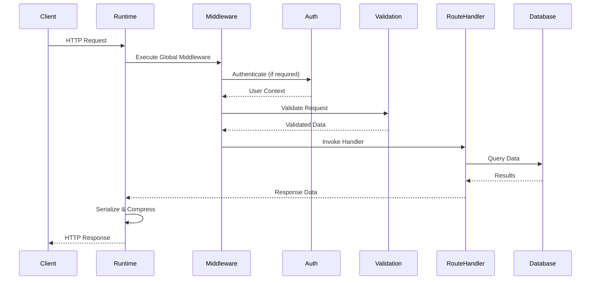

# Design Document: Web Loom API Framework

## Overview

Web Loom API is a TypeScript-based meta-framework for building production-ready REST APIs optimized for serverless and edge computing platforms. The framework follows a model-driven development approach where developers define data models once, and the framework automatically generates CRUD routes, validation schemas, database schemas, OpenAPI specifications, and type-safe clients.

### Core Design Principles

1. **Adapter-Based Architecture**: All major components (API framework, database, validation, auth, email) are abstracted behind adapter interfaces, enabling developers to swap implementations without code changes.

2. **Model-Driven Development**: Single source of truth for data structures that drives code generation, validation, and documentation.

3. **Serverless-First**: Optimized for cold start performance, stateless execution, and edge deployment with minimal initialization overhead.

4. **Type Safety**: End-to-end TypeScript type safety from database queries through API responses to generated clients.

5. **Convention over Configuration**: Sensible defaults with file-based routing, automatic CRUD generation, and zero-config development server.

6. **Developer Experience**: Comprehensive CLI tools, hot reload, interactive documentation, and extensive testing utilities.

### Target Platforms

- Vercel Edge Functions
- Cloudflare Workers
- AWS Lambda
- Node.js servers
- Docker containers

## Monorepo Structure

The framework is organized as a Turborepo-managed monorepo with packages under `packages/*`. All API packages use the `@webloom/api-*` prefix to avoid collision with frontend framework packages:

```
packages/
├── api-core/                    # @webloom/api-core - Core runtime and interfaces
├── api-cli/                     # @webloom/api-cli - CLI tool
├── api-adapters/
│   ├── hono/                   # @webloom/api-adapter-hono - Hono adapter
│   ├── drizzle/                # @webloom/api-adapter-drizzle - Drizzle adapter
│   ├── zod/                    # @webloom/api-adapter-zod - Zod adapter
│   ├── lucia/                  # @webloom/api-adapter-lucia - Lucia auth adapter
│   └── resend/                 # @webloom/api-adapter-resend - Resend email adapter
├── api-generators/
│   ├── crud/                   # @webloom/api-generator-crud - CRUD generator
│   ├── openapi/                # @webloom/api-generator-openapi - OpenAPI generator
│   ├── client/                 # @webloom/api-generator-client - Client generator
│   └── types/                  # @webloom/api-generator-types - Type generator
├── api-middleware/
│   ├── auth/                   # @webloom/api-middleware-auth - Auth middleware
│   ├── cors/                   # @webloom/api-middleware-cors - CORS middleware
│   ├── rate-limit/             # @webloom/api-middleware-rate-limit - Rate limiting
│   └── validation/             # @webloom/api-middleware-validation - Validation
├── api-testing/                # @webloom/api-testing - Testing utilities
├── api-deployment/
│   ├── vercel/                 # @webloom/api-deployment-vercel - Vercel adapter
│   ├── cloudflare/             # @webloom/api-deployment-cloudflare - Cloudflare adapter
│   └── aws/                    # @webloom/api-deployment-aws - AWS Lambda adapter
└── api-shared/                 # @webloom/api-shared - Shared types and utilities
```

## Architecture

### High-Level Architecture

```mermaid
graph TB
    CLI[CLI Tool<br/>@webloom/api-cli] --> Core[Core Runtime<br/>@webloom/api-core]
    Core --> Registry[Registries<br/>@webloom/api-core]
    Core --> Adapters[Adapter Layer]

    Registry --> ModelReg[Model Registry]
    Registry --> RouteReg[Route Registry]

    Adapters --> API[API Framework Adapter<br/>@webloom/api-adapter-hono]
    Adapters --> DB[Database Adapter<br/>@webloom/api-adapter-drizzle]
    Adapters --> Val[Validation Adapter<br/>@webloom/api-adapter-zod]
    Adapters --> Auth[Auth Adapter<br/>@webloom/api-adapter-lucia]
    Adapters --> Email[Email Adapter<br/>@webloom/api-adapter-resend]

    Core --> Middleware[Middleware System<br/>@webloom/api-middleware-*]
    Core --> Plugins[Plugin System]

    Generators[Code Generators] --> CRUD[CRUD Generator<br/>@webloom/api-generator-crud]
    Generators --> OpenAPI[OpenAPI Generator<br/>@webloom/api-generator-openapi]
    Generators --> Client[Client Generator<br/>@webloom/api-generator-client]
    Generators --> Types[Type Generator<br/>@webloom/api-generator-types]

    CLI --> Generators
    ModelReg --> Generators
    RouteReg --> Generators
```

### Layered Architecture

The framework is organized into distinct layers:

1. **CLI Layer**: Command-line interface for project scaffolding, code generation, and development tools
2. **Core Runtime Layer**: Application bootstrapping, adapter initialization, and request lifecycle management
3. **Adapter Layer**: Pluggable implementations for framework components
4. **Registry Layer**: Central tracking of models and routes for code generation
5. **Generator Layer**: Automated code generation from models and routes
6. **Middleware Layer**: Request/response pipeline with extensibility
7. **Plugin Layer**: Third-party extensions and custom functionality

### Request Lifecycle



### Initialization Sequence

The Core Runtime follows a specific initialization sequence optimized for cold start performance:

1. **Configuration Loading** (5-10ms): Load and validate `webloom.config.ts`
2. **Critical Adapter Initialization** (20-40ms): Initialize API framework and database adapters
3. **Route Discovery** (10-20ms): Scan and register route files from `src/routes`
4. **Model Discovery** (10-20ms): Scan and register model definitions from `src/models`
5. **CRUD Generation** (10-20ms): Generate CRUD routes for registered models
6. **Lazy Adapter Loading** (deferred): Initialize non-critical adapters (email, caching) on first use
7. **Middleware Registration** (5-10ms): Register global and route-specific middleware
8. **Ready State** (total: 60-100ms): Application ready to handle requests

## Components and Interfaces

### Core Runtime

The Core Runtime is the bootstrapping engine responsible for initializing the application.

**Key Responsibilities:**

- Load and validate configuration
- Initialize adapters in dependency order
- Discover and register routes and models
- Manage application lifecycle (startup, shutdown)
- Coordinate request handling

**Interface:**

```typescript
interface CoreRuntime {
  // Initialization
  initialize(config: WebLoomConfig): Promise<void>;

  // Lifecycle management
  start(): Promise<void>;
  shutdown(timeout?: number): Promise<void>;

  // Registry access
  getModelRegistry(): ModelRegistry;
  getRouteRegistry(): RouteRegistry;

  // Adapter access
  getAdapter<T>(type: AdapterType): T;
}
```

**Implementation Strategy:**

- Singleton pattern for global runtime instance
- Lazy initialization of non-critical components
- Connection pooling and reuse across invocations (serverless)
- Graceful degradation when optional features are disabled

### Adapter System

Adapters provide standardized interfaces for swappable components. Each adapter type defines a contract that implementations must fulfill.

#### API Framework Adapter

Abstracts HTTP routing frameworks (default: Hono).

```typescript
interface APIFrameworkAdapter {
  // Route registration
  registerRoute(method: HTTPMethod, path: string, handler: RouteHandler): void;
  registerMiddleware(middleware: Middleware, options?: MiddlewareOptions): void;

  // Request handling
  handleRequest(request: Request): Promise<Response>;

  // Server lifecycle
  listen(port: number): Promise<void>;
  close(): Promise<void>;
}
```

**Default Implementation (Hono):**

- Lightweight (~12KB) with excellent edge runtime support
- Fast routing with radix tree
- Built-in middleware for CORS, compression, logging
- Native Web Standards API (Request/Response)

**Alternative Implementations:**

- Express adapter for Node.js compatibility
- Fastify adapter for high-performance Node.js
- Custom adapters for framework-specific features

#### Database Adapter

Abstracts database connections and ORMs (default: Drizzle + Neon).

```typescript
interface DatabaseAdapter {
  // Connection management
  connect(config: DatabaseConfig): Promise<void>;
  disconnect(): Promise<void>;
  healthCheck(): Promise<boolean>;

  // Query execution
  query<T>(sql: string, params: unknown[]): Promise<T[]>;
  execute(sql: string, params: unknown[]): Promise<void>;

  // Transaction support
  transaction<T>(callback: (tx: Transaction) => Promise<T>): Promise<T>;

  // Query builder
  select<T>(model: ModelDefinition): QueryBuilder<T>;
  insert<T>(model: ModelDefinition, data: T): Promise<T>;
  update<T>(model: ModelDefinition, id: string, data: Partial<T>): Promise<T>;
  delete(model: ModelDefinition, id: string): Promise<void>;

  // Schema management
  createTable(model: ModelDefinition): Promise<void>;
  dropTable(model: ModelDefinition): Promise<void>;
  migrateSchema(migration: Migration): Promise<void>;
}
```

**Default Implementation (Drizzle + Neon):**

- Drizzle ORM: Type-safe query builder with minimal overhead
- Neon: Serverless Postgres with connection pooling and edge support
- Sub-10ms query latency from edge locations
- Automatic prepared statement caching

**Alternative Implementations:**

- Prisma adapter for advanced ORM features
- Kysely adapter for SQL-first approach
- MongoDB adapter for document databases
- DynamoDB adapter for AWS serverless

#### Validation Adapter

Abstracts validation libraries (default: Zod).

```typescript
interface ValidationAdapter {
  // Schema definition
  defineSchema<T>(definition: SchemaDefinition): Schema<T>;

  // Validation
  validate<T>(schema: Schema<T>, data: unknown): ValidationResult<T>;
  validateAsync<T>(schema: Schema<T>, data: unknown): Promise<ValidationResult<T>>;

  // Schema operations
  merge<T, U>(schema1: Schema<T>, schema2: Schema<U>): Schema<T & U>;
  partial<T>(schema: Schema<T>): Schema<Partial<T>>;
  pick<T, K extends keyof T>(schema: Schema<T>, keys: K[]): Schema<Pick<T, K>>;

  // Type extraction
  infer<T>(schema: Schema<T>): T;
}

interface ValidationResult<T> {
  success: boolean;
  data?: T;
  errors?: ValidationError[];
}

interface ValidationError {
  path: string[];
  message: string;
  code: string;
}
```

**Default Implementation (Zod):**

- Runtime type validation with TypeScript inference
- Composable schemas with transformations
- Detailed error messages with field paths
- ~8KB minified, tree-shakeable

**Alternative Implementations:**

- Yup adapter for legacy compatibility
- Joi adapter for Node.js projects
- AJV adapter for JSON Schema validation

#### Auth Adapter

Abstracts authentication systems (default: Lucia).

```typescript
interface AuthAdapter {
  // Session management
  createSession(userId: string, attributes?: Record<string, unknown>): Promise<Session>;
  validateSession(sessionId: string): Promise<SessionValidationResult>;
  invalidateSession(sessionId: string): Promise<void>;

  // User management
  createUser(data: UserData): Promise<User>;
  getUser(userId: string): Promise<User | null>;
  updateUser(userId: string, data: Partial<UserData>): Promise<User>;

  // Password handling
  hashPassword(password: string): Promise<string>;
  verifyPassword(hash: string, password: string): Promise<boolean>;

  // OAuth integration
  getOAuthAuthorizationUrl(provider: string, state: string): string;
  handleOAuthCallback(provider: string, code: string): Promise<User>;

  // API key management
  createApiKey(userId: string, scopes: string[]): Promise<ApiKey>;
  validateApiKey(key: string): Promise<ApiKeyValidationResult>;
  revokeApiKey(keyId: string): Promise<void>;
}

interface Session {
  id: string;
  userId: string;
  expiresAt: Date;
  attributes: Record<string, unknown>;
}

interface SessionValidationResult {
  valid: boolean;
  session?: Session;
  user?: User;
}
```

**Default Implementation (Lucia):**

- Lightweight session management (~5KB)
- Database-backed sessions with automatic cleanup
- Built-in OAuth provider support
- CSRF protection and secure cookie handling

#### Email Adapter

Abstracts email service providers (default: Resend).

```typescript
interface EmailAdapter {
  // Email sending
  send(email: EmailMessage): Promise<EmailResult>;
  sendBatch(emails: EmailMessage[]): Promise<EmailResult[]>;

  // Template support
  sendTemplate(
    templateId: string,
    to: string,
    variables: Record<string, unknown>
  ): Promise<EmailResult>;

  // Verification
  verifyDomain(domain: string): Promise<DomainVerificationResult>;
}

interface EmailMessage {
  from: string;
  to: string | string[];
  subject: string;
  html?: string;
  text?: string;
  attachments?: Attachment[];
  headers?: Record<string, string>;
}

interface EmailResult {
  id: string;
  success: boolean;
  error?: string;
}
```

**Default Implementation (Resend):**

- Modern API with excellent DX
- Built-in template support
- Webhook delivery notifications
- Generous free tier for development

**Alternative Implementations:**

- SendGrid adapter for enterprise features
- AWS SES adapter for AWS deployments
- Postmark adapter for transactional emails

### Configuration Management

Configuration is defined in `webloom.config.ts` using TypeScript for type safety and IDE support.

```typescript
interface WebLoomConfig {
  // Adapter selection
  adapters: {
    api: AdapterConfig<APIFrameworkAdapter>;
    database: AdapterConfig<DatabaseAdapter>;
    validation: AdapterConfig<ValidationAdapter>;
    auth?: AdapterConfig<AuthAdapter>;
    email?: AdapterConfig<EmailAdapter>;
  };

  // Database configuration
  database: {
    url: string;
    poolSize?: number;
    connectionTimeout?: number;
    readReplicas?: string[];
  };

  // Security configuration
  security: {
    cors: CORSConfig;
    rateLimit?: RateLimitConfig;
    requestSizeLimit?: number;
    securityHeaders?: SecurityHeadersConfig;
  };

  // Feature flags
  features: {
    crud?: boolean;
    graphql?: boolean;
    websocket?: boolean;
    caching?: boolean;
    auditLogging?: boolean;
  };

  // Observability
  observability: {
    logging: LoggingConfig;
    metrics?: MetricsConfig;
    tracing?: TracingConfig;
  };

  // Development
  development?: {
    hotReload?: boolean;
    apiDocs?: boolean;
    detailedErrors?: boolean;
  };
}
```

**Configuration Validation:**

- Schema validation at startup using Zod
- Environment variable interpolation: `${ENV_VAR}`
- Environment-specific overrides: `.env.development`, `.env.production`
- Type-safe access through generated types

### Model Registry

The Model Registry maintains a central catalog of all model definitions for code generation and runtime operations.

```typescript
interface ModelRegistry {
  // Registration
  register(model: ModelDefinition): void;
  unregister(modelName: string): void;

  // Retrieval
  get(modelName: string): ModelDefinition | undefined;
  getAll(): ModelDefinition[];
  has(modelName: string): boolean;

  // Relationships
  getRelationships(modelName: string): Relationship[];
  getDependencies(modelName: string): string[];

  // Metadata
  getMetadata(modelName: string): ModelMetadata;
}

interface ModelDefinition {
  name: string;
  tableName?: string;
  fields: FieldDefinition[];
  relationships?: Relationship[];
  options?: ModelOptions;
  metadata?: ModelMetadata;
}

interface FieldDefinition {
  name: string;
  type: FieldType;
  validation?: ValidationRules;
  database?: DatabaseFieldConfig;
  computed?: boolean;
  transform?: FieldTransform;
  default?: unknown | (() => unknown);
}

interface ModelOptions {
  timestamps?: boolean;
  softDelete?: boolean;
  optimisticLocking?: boolean;
  crud?: boolean | CRUDOptions;
  permissions?: PermissionConfig;
}
```

**Registry Operations:**

- Thread-safe registration for concurrent access
- Dependency resolution for relationship ordering
- Change detection for hot reload
- Validation of model definitions at registration time

### Route Registry

The Route Registry tracks all route handlers for request routing and code generation.

```typescript
interface RouteRegistry {
  // Registration
  register(route: RouteDefinition): void;
  unregister(path: string, method: HTTPMethod): void;

  // Retrieval
  get(path: string, method: HTTPMethod): RouteDefinition | undefined;
  getAll(): RouteDefinition[];
  getByPath(path: string): RouteDefinition[];

  // Matching
  match(path: string, method: HTTPMethod): RouteMatch | undefined;

  // Metadata
  getMetadata(path: string, method: HTTPMethod): RouteMetadata;
}

interface RouteDefinition {
  path: string;
  method: HTTPMethod;
  handler: RouteHandler;
  validation?: RouteValidation;
  middleware?: Middleware[];
  auth?: AuthRequirement;
  rateLimit?: RateLimitConfig;
  cache?: CacheConfig;
  metadata?: RouteMetadata;
}

interface RouteValidation {
  body?: Schema;
  query?: Schema;
  params?: Schema;
  headers?: Schema;
}

interface RouteMetadata {
  description?: string;
  tags?: string[];
  deprecated?: boolean;
  version?: string;
  responses?: ResponseDefinition[];
}
```

**File-Based Route Discovery:**

- Scan `src/routes` directory recursively
- Map file paths to URL paths: `src/routes/users/[id].ts` → `/users/:id`
- Support dynamic segments: `[param]` → `:param`
- Support catch-all routes: `[...path]` → `*`
- Detect conflicts and report errors

### CRUD Generator

The CRUD Generator automatically creates REST endpoints from model definitions.

```typescript
interface CRUDGenerator {
  // Generation
  generate(model: ModelDefinition): GeneratedRoutes;
  generateAll(): GeneratedRoutes[];

  // Customization
  customize(modelName: string, options: CRUDOptions): void;
}

interface GeneratedRoutes {
  create: RouteDefinition; // POST /resource
  list: RouteDefinition; // GET /resource
  get: RouteDefinition; // GET /resource/:id
  update: RouteDefinition; // PUT /resource/:id
  patch: RouteDefinition; // PATCH /resource/:id
  delete: RouteDefinition; // DELETE /resource/:id
}

interface CRUDOptions {
  endpoints?: {
    create?: boolean;
    list?: boolean;
    get?: boolean;
    update?: boolean;
    patch?: boolean;
    delete?: boolean;
  };
  pagination?: PaginationConfig;
  filtering?: FilteringConfig;
  sorting?: SortingConfig;
  search?: SearchConfig;
}
```

**Generated Endpoint Features:**

**List Endpoint (GET /resource):**

- Page-based pagination: `?page=1&limit=20`
- Cursor-based pagination: `?cursor=abc&limit=20`
- Filtering: `?status=active&age[gte]=18`
- Sorting: `?sort=-createdAt,name`
- Field selection: `?fields=id,name,email`
- Search: `?search=query`
- Relationship loading: `?include=posts,comments`

**Create Endpoint (POST /resource):**

- Request body validation against model schema
- Nested relationship creation
- Default value application
- Timestamp generation
- Transaction wrapping

**Get Endpoint (GET /resource/:id):**

- ID validation
- 404 handling
- Relationship eager loading
- Field selection
- Computed field calculation

**Update Endpoints (PUT/PATCH /resource/:id):**

- Partial vs full update semantics
- Optimistic locking support
- Relationship updates
- Validation
- Audit logging

**Delete Endpoint (DELETE /resource/:id):**

- Soft delete support
- Cascade delete handling
- Constraint checking
- Audit logging

### CLI Tool

The CLI provides commands for project management, code generation, and development.

```typescript
interface CLITool {
  // Project management
  init(options: InitOptions): Promise<void>;

  // Code generation
  generate(type: GenerationType, options: GenerateOptions): Promise<void>;

  // Development
  dev(options: DevOptions): Promise<void>;

  // Database operations
  migrate(action: MigrateAction, options: MigrateOptions): Promise<void>;
  seed(options: SeedOptions): Promise<void>;

  // Testing
  test(options: TestOptions): Promise<void>;

  // Deployment
  deploy(platform: Platform, options: DeployOptions): Promise<void>;
}
```

**Command Structure:**

```bash
# Project initialization
webloom init [project-name] [--template=<template>] [--database=<db>]

# Code generation
webloom generate model <name> [--fields=<fields>]
webloom generate route <path> [--methods=<methods>]
webloom generate openapi [--output=<file>]
webloom generate client [--output=<dir>]
webloom generate types

# Development
webloom dev [--port=<port>] [--host=<host>]

# Database operations
webloom migrate create <name>
webloom migrate up [--steps=<n>]
webloom migrate down [--steps=<n>]
webloom migrate status
webloom seed [--file=<file>]

# Component switching
webloom switch database <adapter>
webloom switch auth <adapter>

# Testing
webloom test [--watch] [--coverage]
webloom test:contract
webloom test:load

# Deployment
webloom deploy vercel
webloom deploy cloudflare
webloom deploy aws
```

### Code Generators

#### OpenAPI Generator

Generates OpenAPI 3.1 specifications from models and routes.

```typescript
interface OpenAPIGenerator {
  generate(): OpenAPISpec;
  generateForModel(model: ModelDefinition): SchemaObject;
  generateForRoute(route: RouteDefinition): PathItemObject;
}
```

**Generation Strategy:**

- Extract schemas from model definitions
- Map validation rules to OpenAPI constraints
- Generate request/response examples
- Include authentication requirements
- Document rate limits and caching
- Support custom OpenAPI extensions

#### TypeScript Client Generator

Generates type-safe API clients for frontend consumption.

```typescript
interface ClientGenerator {
  generate(options: ClientGenerateOptions): GeneratedClient;
}

interface GeneratedClient {
  types: string; // TypeScript interfaces
  client: string; // API client code
  hooks?: string; // React hooks (optional)
}
```

**Generated Client Features:**

- Typed request/response interfaces
- Automatic serialization/deserialization
- Error handling with typed errors
- Request cancellation support
- Retry logic with exponential backoff
- Optional React hooks integration

**Example Generated Code:**

```typescript
// Generated types
interface User {
  id: string;
  email: string;
  name: string;
  createdAt: Date;
}

// Generated client
class APIClient {
  async getUser(id: string): Promise<User> {
    const response = await fetch(`${this.baseUrl}/users/${id}`);
    if (!response.ok) throw new APIError(response);
    return response.json();
  }

  async listUsers(params?: ListUsersParams): Promise<PaginatedResponse<User>> {
    const query = new URLSearchParams(params);
    const response = await fetch(`${this.baseUrl}/users?${query}`);
    if (!response.ok) throw new APIError(response);
    return response.json();
  }
}
```

### Middleware System

Middleware provides a composable request/response pipeline.

```typescript
interface Middleware {
  (context: RequestContext, next: NextFunction): Promise<Response | void>;
}

interface RequestContext {
  request: Request;
  params: Record<string, string>;
  query: Record<string, string>;
  body: unknown;
  user?: User;
  session?: Session;
  metadata: Map<string, unknown>;
}

type NextFunction = () => Promise<Response>;
```

**Built-in Middleware:**

1. **CORS Middleware**: Handles preflight requests and CORS headers
2. **Authentication Middleware**: Validates sessions and API keys
3. **Rate Limiting Middleware**: Enforces request rate limits
4. **Validation Middleware**: Validates request data against schemas
5. **Logging Middleware**: Logs requests and responses
6. **Compression Middleware**: Compresses responses
7. **Security Headers Middleware**: Adds security headers
8. **Error Handling Middleware**: Catches and formats errors
9. **Caching Middleware**: Implements response caching
10. **Tracing Middleware**: Adds distributed tracing

**Middleware Registration:**

```typescript
// Global middleware (applies to all routes)
app.use(loggingMiddleware);
app.use(corsMiddleware);

// Route-specific middleware
app.get('/admin/*', authMiddleware, adminMiddleware);

// Middleware with configuration
app.use(rateLimitMiddleware({ limit: 100, window: '1m' }));
```

**Execution Order:**

1. Global middleware (in registration order)
2. Route-specific middleware (in registration order)
3. Route handler
4. Response middleware (in reverse order)

### Plugin System

Plugins extend framework functionality without modifying core code.

```typescript
interface Plugin {
  name: string;
  version: string;

  // Lifecycle hooks
  onInit?(runtime: CoreRuntime): Promise<void>;
  onStart?(runtime: CoreRuntime): Promise<void>;
  onShutdown?(runtime: CoreRuntime): Promise<void>;

  // Extension points
  registerMiddleware?(app: Application): void;
  registerRoutes?(app: Application): void;
  registerModels?(registry: ModelRegistry): void;
  extendConfig?(schema: ConfigSchema): void;
}
```

**Plugin Examples:**

**Monitoring Plugin:**

```typescript
const monitoringPlugin: Plugin = {
  name: 'monitoring',
  version: '1.0.0',

  registerMiddleware(app) {
    app.use(async (ctx, next) => {
      const start = Date.now();
      await next();
      const duration = Date.now() - start;
      metrics.recordRequest(ctx.request.method, ctx.request.path, duration);
    });
  },
};
```

**GraphQL Plugin:**

```typescript
const graphqlPlugin: Plugin = {
  name: 'graphql',
  version: '1.0.0',

  onInit(runtime) {
    const models = runtime.getModelRegistry().getAll();
    const schema = generateGraphQLSchema(models);
    this.schema = schema;
  },

  registerRoutes(app) {
    app.post('/graphql', createGraphQLHandler(this.schema));
    app.get('/graphql', createGraphQLPlayground());
  },
};
```

**Plugin Discovery:**

- Plugins specified in `webloom.config.ts`
- Auto-discovery from `node_modules/@webloom/*`
- Local plugins from `src/plugins`

### Testing Utilities

Comprehensive testing utilities for unit, integration, and contract testing.

```typescript
interface TestClient {
  // HTTP methods
  get(path: string, options?: RequestOptions): Promise<TestResponse>;
  post(path: string, body?: unknown, options?: RequestOptions): Promise<TestResponse>;
  put(path: string, body?: unknown, options?: RequestOptions): Promise<TestResponse>;
  patch(path: string, body?: unknown, options?: RequestOptions): Promise<TestResponse>;
  delete(path: string, options?: RequestOptions): Promise<TestResponse>;

  // Authentication
  authenticate(user: User): void;
  setApiKey(key: string): void;

  // Assertions
  expect(response: TestResponse): ResponseAssertions;
}

interface TestResponse {
  status: number;
  headers: Headers;
  body: unknown;
  json<T>(): T;
  text(): string;
}

interface ResponseAssertions {
  toHaveStatus(status: number): void;
  toHaveHeader(name: string, value?: string): void;
  toMatchSchema(schema: Schema): void;
  toHaveBody(body: unknown): void;
}
```

**Test Utilities:**

**Database Seeding:**

```typescript
// Factory functions for test data
const userFactory = defineFactory(User, {
  email: () => faker.internet.email(),
  name: () => faker.person.fullName(),
  role: 'user',
});

// Seeding
await seed(User, 10, userFactory);
```

**Mock Adapters:**

```typescript
// Mock database for isolated testing
const mockDb = createMockDatabase();
mockDb.mockQuery('SELECT * FROM users', [{ id: 1, name: 'Test' }]);

// Mock auth for testing protected routes
const mockAuth = createMockAuth();
mockAuth.mockUser({ id: '1', role: 'admin' });
```

**Contract Testing:**

```typescript
// Verify API matches OpenAPI spec
await testContract({
  spec: './openapi.json',
  baseUrl: 'http://localhost:3000',
});
```

## Data Models

### Core Data Structures

#### Model Definition Structure

```typescript
interface ModelDefinition {
  name: string; // Model name (PascalCase)
  tableName?: string; // Database table name (snake_case)
  fields: FieldDefinition[]; // Field definitions
  relationships?: Relationship[]; // Relations to other models
  options?: ModelOptions; // Model-level options
  metadata?: ModelMetadata; // Documentation metadata
}
```

#### Field Types

The framework supports the following field types with corresponding database and TypeScript mappings:

| Field Type | TypeScript Type | Database Type (Postgres) | Validation                    |
| ---------- | --------------- | ------------------------ | ----------------------------- |
| string     | string          | VARCHAR/TEXT             | min, max, pattern, email, url |
| number     | number          | INTEGER/DECIMAL          | min, max, integer, positive   |
| boolean    | boolean         | BOOLEAN                  | -                             |
| date       | Date            | TIMESTAMP                | min, max                      |
| uuid       | string          | UUID                     | uuid format                   |
| enum       | union type      | ENUM/VARCHAR             | allowed values                |
| json       | object          | JSONB                    | schema validation             |
| array      | T[]             | ARRAY                    | item schema, min/max length   |
| decimal    | Decimal         | DECIMAL                  | precision, scale              |

#### Relationship Types

```typescript
type RelationshipType = 'one-to-one' | 'one-to-many' | 'many-to-one' | 'many-to-many';

interface Relationship {
  type: RelationshipType;
  target: string; // Target model name
  foreignKey?: string; // Foreign key field
  through?: string; // Join table (many-to-many)
  cascade?: CascadeOption; // Delete behavior
  eager?: boolean; // Auto-load related data
}

type CascadeOption = 'cascade' | 'restrict' | 'set-null';
```

#### Configuration Data Model

```typescript
interface WebLoomConfig {
  adapters: AdapterConfig;
  database: DatabaseConfig;
  security: SecurityConfig;
  features: FeatureFlags;
  observability: ObservabilityConfig;
  development?: DevelopmentConfig;
}

interface DatabaseConfig {
  url: string;
  poolSize: number;
  connectionTimeout: number;
  readReplicas?: string[];
  ssl?: boolean;
}

interface SecurityConfig {
  cors: {
    origins: string[];
    credentials: boolean;
    methods: string[];
    headers: string[];
  };
  rateLimit?: {
    limit: number;
    window: string;
    keyGenerator?: (req: Request) => string;
  };
  requestSizeLimit: number;
}
```

#### Request/Response Models

```typescript
interface PaginatedResponse<T> {
  data: T[];
  pagination: {
    page: number;
    limit: number;
    total: number;
    totalPages: number;
    hasNext: boolean;
    hasPrev: boolean;
  };
}

interface ErrorResponse {
  error: {
    code: string;
    message: string;
    details?: ValidationError[];
    timestamp: string;
    requestId: string;
  };
}
```

## Correctness Properties

A property is a characteristic or behavior that should hold true across all valid executions of a system—essentially, a formal statement about what the system should do. Properties serve as the bridge between human-readable specifications and machine-verifiable correctness guarantees.

### Property 1: Configuration Round-Trip Preservation

For any valid configuration object, parsing it to a file, then formatting that file, then parsing it again should produce an equivalent configuration object.

**Validates: Requirements 45.1**

### Property 2: Model Serialization Round-Trip

For any valid model instance, serializing it to JSON then deserializing it back should produce an equivalent object with all field values preserved.

**Validates: Requirements 46.1, 46.2**

### Property 3: Special Type Round-Trip Handling

For any model instance containing special types (Date, BigInt, Buffer), the round-trip serialization/deserialization should preserve the values and types correctly.

**Validates: Requirements 46.4**

### Property 4: Adapter Interface Verification

For any adapter implementation, if it is missing required interface methods, the Core Runtime should reject it with a descriptive error message.

**Validates: Requirements 2.6, 2.7**

### Property 5: Configuration Validation Rejection

For any invalid configuration (missing required fields, wrong types, unknown properties), the Core Runtime should terminate with specific validation errors describing what is wrong.

**Validates: Requirements 3.6, 3.7, 1.5**

### Property 6: Model-Schema Consistency

For any model definition, the validation schema and database schema should be consistent—fields defined in one should have corresponding definitions in the other with compatible types.

**Validates: Requirements 4.7**

### Property 7: CRUD Endpoint Generation Completeness

For any model definition registered with CRUD enabled, the CRUD Generator should generate all six standard endpoints (POST, GET list, GET by id, PUT, PATCH, DELETE) with correct paths and methods.

**Validates: Requirements 5.1, 5.2, 5.3, 5.4, 5.5, 5.6**

### Property 8: Request Validation Enforcement

For any CRUD endpoint, when it receives a request with invalid data (violating the model's validation schema), it should return HTTP 400 with structured field-level error details.

**Validates: Requirements 5.7, 5.8, 7.2, 7.3**

### Property 9: Valid Request Processing

For any CRUD endpoint, when it receives a valid request (passing validation), it should execute the corresponding database operation and return a successful response.

**Validates: Requirements 5.9, 7.4**

### Property 10: Route File Discovery Completeness

For any directory containing route files, the Core Runtime should discover and register all route files, with no files being missed.

**Validates: Requirements 6.1, 1.3**

### Property 11: File Path to URL Mapping

For any route file path following the framework conventions, the Web Loom API should map it to the correct URL path (e.g., `src/routes/users/[id].ts` → `/users/:id`).

**Validates: Requirements 6.2, 6.3, 6.4**

### Property 12: Route Conflict Detection

For any set of route files, if multiple files would map to the same URL path and HTTP method, the Core Runtime should detect the conflict and terminate with a descriptive error.

**Validates: Requirements 6.7**

### Property 13: HTTP Method Handler Registration

For any route file exporting HTTP method handlers (GET, POST, PUT, PATCH, DELETE, OPTIONS), all exported handlers should be registered with the Route Registry.

**Validates: Requirements 6.5, 6.6**

### Property 14: Nested Object Validation

For any validation schema containing nested objects, the Validation Adapter should validate all nested fields according to their schemas and report errors with correct field paths.

**Validates: Requirements 7.5**

### Property 15: Array Validation with Item Schemas

For any validation schema containing array fields with item schemas, the Validation Adapter should validate each array item against the item schema and report errors with correct array indices.

**Validates: Requirements 7.6**

### Property 16: Custom Validation Function Support

For any validation schema with custom validation functions, the Validation Adapter should execute the custom validators and include their results in the validation outcome.

**Validates: Requirements 7.7**

### Property 17: Model Registration Tracking

For any model definition created, the Model Registry should register it and make it available for retrieval and code generation.

**Validates: Requirements 4.2**

### Property 18: OpenAPI Specification Completeness

For any set of registered models and routes, the OpenAPI Generator should produce a valid OpenAPI 3.1 specification that includes all routes, all model schemas, all parameters, and all metadata.

**Validates: Requirements 19.1, 19.2, 19.3, 19.4, 19.5, 19.6**

### Property 19: TypeScript Client Generation Completeness

For any set of registered routes, the Client Generator should produce TypeScript client code with typed functions for each endpoint and TypeScript interfaces for all request/response types.

**Validates: Requirements 20.1, 20.2, 20.3, 20.4**

### Property 20: Adapter Initialization Order

For any configuration specifying multiple adapters with dependencies, the Core Runtime should initialize them in dependency order (e.g., database before models, models before CRUD routes).

**Validates: Requirements 1.2**

### Property 21: Model Discovery Completeness

For any directory containing model definition files, the Core Runtime should discover and register all model files after route handlers are registered.

**Validates: Requirements 1.4**

### Property 22: Deserialized Data Validation

For any model instance deserialized from JSON, the Validation Adapter should validate the deserialized data against the model schema before accepting it.

**Validates: Requirements 46.3**

## Error Handling

### Error Classification

The framework categorizes errors into distinct types for appropriate handling:

1. **Validation Errors** (HTTP 400)
   - Invalid request body, query parameters, or path parameters
   - Schema validation failures
   - Type mismatches
   - Constraint violations

2. **Authentication Errors** (HTTP 401)
   - Missing or invalid session tokens
   - Expired sessions
   - Invalid API keys
   - Failed OAuth callbacks

3. **Authorization Errors** (HTTP 403)
   - Insufficient permissions
   - Role requirements not met
   - Field-level access denied
   - Rate limit exceeded (HTTP 429)

4. **Not Found Errors** (HTTP 404)
   - Resource not found by ID
   - Route not found
   - Unsupported API version

5. **Conflict Errors** (HTTP 409)
   - Optimistic locking version mismatch
   - Unique constraint violations
   - Cascade delete restrictions

6. **Server Errors** (HTTP 500)
   - Unhandled exceptions
   - Database connection failures
   - Adapter initialization failures
   - Internal logic errors

### Error Response Format

All errors follow a consistent JSON structure:

```typescript
interface ErrorResponse {
  error: {
    code: string; // Machine-readable error code
    message: string; // Human-readable error message
    details?: unknown; // Additional error context
    timestamp: string; // ISO 8601 timestamp
    requestId: string; // Correlation ID for tracing
    path?: string; // Request path
  };
}
```

**Validation Error Details:**

```typescript
interface ValidationErrorDetails {
  fields: Array<{
    path: string[]; // Field path (e.g., ["user", "email"])
    message: string; // Error message
    code: string; // Validation rule that failed
    value?: unknown; // Invalid value (if safe to include)
  }>;
}
```

### Error Handling Strategy

1. **Global Error Handler**: Catches all unhandled errors and formats them consistently
2. **Error Middleware**: Intercepts errors from route handlers and middleware
3. **Validation Middleware**: Catches validation errors before reaching handlers
4. **Database Error Mapping**: Translates database errors to appropriate HTTP errors
5. **Development vs Production**: Detailed stack traces in development, sanitized messages in production
6. **Error Logging**: All errors logged with context for debugging
7. **Error Tracking Integration**: Optional integration with Sentry, Rollbar, etc.

### Graceful Degradation

When non-critical components fail:

- Email adapter failure: Log error, continue processing, return success
- Cache adapter failure: Fall back to direct database queries
- Metrics collection failure: Log error, continue processing
- Tracing failure: Log error, continue without tracing

When critical components fail:

- Database connection failure: Return HTTP 503, retry with backoff
- Configuration loading failure: Terminate with error message
- Adapter initialization failure: Terminate with error message

## Testing Strategy

### Dual Testing Approach

The framework requires both unit testing and property-based testing for comprehensive coverage:

**Unit Tests**: Verify specific examples, edge cases, and error conditions

- Specific configuration examples (valid and invalid)
- Edge cases (empty arrays, null values, boundary conditions)
- Error conditions (network failures, invalid inputs)
- Integration points between components
- Mock-based isolation testing

**Property-Based Tests**: Verify universal properties across all inputs

- Configuration round-trip preservation
- Model serialization correctness
- Validation consistency
- Code generation completeness
- Route discovery accuracy

Together, unit tests catch concrete bugs while property tests verify general correctness across the input space.

### Property-Based Testing Configuration

**Library Selection**: Use `fast-check` for TypeScript property-based testing

- Excellent TypeScript support with type inference
- Rich set of built-in generators (strings, numbers, objects, arrays)
- Composable generators for complex data structures
- Shrinking support for minimal failing examples

**Test Configuration**:

- Minimum 100 iterations per property test (due to randomization)
- Configurable seed for reproducible test runs
- Timeout of 30 seconds per property test
- Verbose mode for debugging failures

**Property Test Tagging**:
Each property test must include a comment referencing the design document property:

```typescript
// Feature: web-loom-api-framework, Property 1: Configuration Round-Trip Preservation
test('configuration parsing preserves data through format cycle', () => {
  fc.assert(
    fc.property(configGenerator, (config) => {
      const formatted = formatConfig(parseConfig(config));
      const reparsed = parseConfig(formatted);
      expect(reparsed).toEqual(config);
    }),
    { numRuns: 100 }
  );
});
```

### Test Organization

Tests are co-located with their respective packages in the monorepo:

```
packages/
├── api-core/
│   ├── src/
│   ├── tests/
│   │   ├── unit/
│   │   │   ├── runtime.test.ts
│   │   │   ├── config.test.ts
│   │   │   └── registry.test.ts
│   │   └── property/
│   │       ├── config-roundtrip.test.ts
│   │       └── model-serialization.test.ts
│   └── package.json
├── api-adapters/
│   ├── hono/
│   │   ├── src/
│   │   ├── tests/
│   │   │   └── unit/
│   │   │       └── adapter.test.ts
│   │   └── package.json
│   ├── drizzle/
│   │   ├── src/
│   │   ├── tests/
│   │   │   └── unit/
│   │   │       └── adapter.test.ts
│   │   └── package.json
│   └── zod/
│       ├── src/
│       ├── tests/
│       │   ├── unit/
│       │   │   └── adapter.test.ts
│       │   └── property/
│       │       └── validation.test.ts
│       └── package.json
├── api-generators/
│   ├── crud/
│   │   ├── src/
│   │   ├── tests/
│   │   │   ├── unit/
│   │   │   │   └── generator.test.ts
│   │   │   └── property/
│   │   │       └── code-generation.test.ts
│   │   └── package.json
│   ├── openapi/
│   │   ├── src/
│   │   ├── tests/
│   │   │   └── unit/
│   │   │       └── generator.test.ts
│   │   └── package.json
│   └── client/
│       ├── src/
│       ├── tests/
│       │   └── unit/
│       │       └── generator.test.ts
│       └── package.json
├── api-middleware/
│   ├── auth/
│   │   ├── src/
│   │   ├── tests/
│   │   │   └── unit/
│   │   │       └── middleware.test.ts
│   │   └── package.json
│   └── validation/
│       ├── src/
│       ├── tests/
│       │   └── unit/
│       │       └── middleware.test.ts
│       └── package.json
├── api-testing/
│   ├── src/
│   │   ├── test-client.ts
│   │   ├── mock-adapters.ts
│   │   └── fixtures.ts
│   └── package.json
└── api-cli/
    ├── src/
    ├── tests/
    │   ├── unit/
    │   │   └── commands.test.ts
    │   └── e2e/
    │       └── full-workflow.test.ts
    └── package.json

# Integration and E2E tests at root level
tests/
├── integration/                   # Cross-package integration tests
│   ├── crud-endpoints.test.ts
│   ├── authentication.test.ts
│   └── database-operations.test.ts
├── e2e/                          # End-to-end tests
│   ├── full-application.test.ts
│   └── deployment.test.ts
└── fixtures/                     # Shared test data
    ├── configs/
    ├── models/
    └── routes/
```

### Test Data Generation

**Generators for Property Tests**:

```typescript
// Configuration generator
const configGenerator = fc.record({
  adapters: fc.record({
    api: adapterConfigGenerator,
    database: adapterConfigGenerator,
    validation: adapterConfigGenerator,
  }),
  database: databaseConfigGenerator,
  security: securityConfigGenerator,
});

// Model definition generator
const modelGenerator = fc.record({
  name: fc.string({ minLength: 1 }),
  fields: fc.array(fieldGenerator, { minLength: 1 }),
  options: fc.option(modelOptionsGenerator),
});

// Route definition generator
const routeGenerator = fc.record({
  path: fc.string({ minLength: 1 }),
  method: fc.constantFrom('GET', 'POST', 'PUT', 'PATCH', 'DELETE'),
  handler: fc.func(fc.anything()),
});
```

### Testing Utilities Provided

The `@webloom/api-testing` package provides comprehensive testing utilities:

**Test Client** (`@webloom/api-testing`):

```typescript
import { createTestClient } from '@webloom/api-testing';

const client = createTestClient(app);

// Make requests without network
const response = await client.get('/users/123');
expect(response.status).toBe(200);
expect(response.body).toMatchSchema(userSchema);

// Authenticated requests
client.authenticate({ id: '1', role: 'admin' });
const response = await client.post('/admin/users', userData);
```

**Database Seeding** (`@webloom/api-testing`):

```typescript
import { defineFactory, seed } from '@webloom/api-testing';

// Factory-based seeding
const userFactory = defineFactory(User, {
  email: () => faker.internet.email(),
  name: () => faker.person.fullName(),
});

await seed(User, 10, userFactory);
```

**Mock Adapters** (`@webloom/api-testing`):

```typescript
import { createMockDatabase, createMockAuth } from '@webloom/api-testing';

// Mock database for isolated testing
const mockDb = createMockDatabase();
mockDb.mockQuery('SELECT * FROM users WHERE id = ?', [{ id: '1', name: 'Test User' }]);

// Mock auth for testing protected routes
const mockAuth = createMockAuth();
mockAuth.mockUser({ id: '1', role: 'admin' });
```

### Contract Testing

Verify that the actual API implementation matches the OpenAPI specification:

```typescript
import { testContract } from '@webloom/api-testing';

await testContract({
  spec: './openapi.json',
  baseUrl: 'http://localhost:3000',
  tests: {
    validateSchemas: true,
    validateStatusCodes: true,
    validateHeaders: true,
  },
});
```

### Performance Testing

Benchmark critical paths to ensure performance requirements are met:

```typescript
import { benchmark } from '@webloom/api-testing';

benchmark(
  'cold start initialization',
  async () => {
    const runtime = new CoreRuntime();
    await runtime.initialize(config);
  },
  {
    maxDuration: 100, // milliseconds
    iterations: 100,
  }
);
```

## Security Considerations

### Input Validation and Sanitization

1. **Request Validation**: All incoming requests validated against schemas before processing
2. **SQL Injection Prevention**: Parameterized queries through database adapter
3. **XSS Prevention**: HTML escaping in validation adapter by default
4. **Path Traversal Prevention**: Route path validation and normalization
5. **Size Limits**: Configurable request body size limits (default 1MB)
6. **Rate Limiting**: Per-IP and per-user rate limiting with configurable windows

### Authentication and Authorization

1. **Session Management**: Secure session tokens with configurable expiration
2. **Password Hashing**: bcrypt with configurable work factor (default 10)
3. **API Key Management**: Scoped API keys with revocation support
4. **OAuth2 Integration**: Support for major providers (Google, GitHub, etc.)
5. **RBAC**: Role-based access control with hierarchical roles
6. **Field-Level Permissions**: Restrict access to sensitive fields

### Security Headers

Automatically applied to all responses:

- `X-Content-Type-Options: nosniff`
- `X-Frame-Options: DENY`
- `X-XSS-Protection: 1; mode=block`
- `Strict-Transport-Security: max-age=31536000; includeSubDomains`
- `Content-Security-Policy: default-src 'self'` (configurable)

### Audit Logging

Security-relevant events logged to separate audit stream:

- Authentication attempts (success/failure)
- Authorization failures
- Data modifications (create/update/delete)
- Configuration changes
- API key creation/revocation

## Performance Optimization

### Cold Start Optimization

Strategies to minimize serverless cold start times:

1. **Lazy Loading**: Non-critical adapters loaded on first use
2. **Code Splitting**: Separate bundles for different routes
3. **Tree Shaking**: Remove unused code through ES modules
4. **Minimal Dependencies**: Core runtime <50KB gzipped
5. **Connection Reuse**: Database connections cached between invocations
6. **Compiled Route Handlers**: Pre-compiled handlers cached in memory

### Caching Strategy

Multi-level caching for optimal performance:

1. **Response Caching**: Cache GET responses with configurable TTL
2. **Query Result Caching**: Cache database query results
3. **Prepared Statement Caching**: Reuse prepared statements
4. **Configuration Caching**: Cache parsed configuration
5. **Schema Caching**: Cache compiled validation schemas

**Cache Invalidation**:

- Time-based expiration (TTL)
- Event-based invalidation (on data modification)
- Manual invalidation via API
- Pattern-based invalidation (e.g., `/users/*`)

### Database Optimization

1. **Connection Pooling**: Reuse connections across requests
2. **Read Replicas**: Route read queries to replicas
3. **Query Optimization**: Automatic index suggestions
4. **Batch Operations**: Combine multiple operations in transactions
5. **Eager Loading**: Optimize N+1 queries with relationship loading
6. **Pagination**: Cursor-based pagination for large datasets

### Bundle Size Optimization

Target bundle sizes:

- Core runtime: <50KB gzipped
- With Hono adapter: <65KB gzipped
- With Drizzle adapter: <80KB gzipped
- Full stack (all adapters): <150KB gzipped

Techniques:

- Tree shaking through ES modules
- Dynamic imports for optional features
- Minimal dependencies (prefer native APIs)
- Code splitting by route

## Observability

### Structured Logging

All logs output in JSON format for machine parsing:

```json
{
  "timestamp": "2024-01-15T10:30:45.123Z",
  "level": "info",
  "message": "Request completed",
  "requestId": "req_abc123",
  "method": "GET",
  "path": "/users/123",
  "status": 200,
  "duration": 45,
  "userId": "user_xyz",
  "metadata": {
    "cacheHit": true
  }
}
```

**Log Levels**:

- `debug`: Detailed debugging information
- `info`: General informational messages
- `warn`: Warning messages for potential issues
- `error`: Error messages with stack traces

**Sensitive Data Sanitization**:

- Passwords redacted
- API keys masked
- Credit card numbers removed
- PII anonymized in production

### Metrics Collection

Prometheus-compatible metrics exposed at `/metrics`:

**Request Metrics**:

- `http_requests_total`: Counter by method, path, status
- `http_request_duration_seconds`: Histogram with percentiles
- `http_request_size_bytes`: Histogram of request sizes
- `http_response_size_bytes`: Histogram of response sizes

**Database Metrics**:

- `db_queries_total`: Counter by operation type
- `db_query_duration_seconds`: Histogram with percentiles
- `db_connections_active`: Gauge of active connections
- `db_connections_idle`: Gauge of idle connections

**Cache Metrics**:

- `cache_hits_total`: Counter of cache hits
- `cache_misses_total`: Counter of cache misses
- `cache_hit_rate`: Gauge of hit rate percentage

**Application Metrics**:

- `app_cold_starts_total`: Counter of cold starts
- `app_initialization_duration_seconds`: Histogram
- `app_errors_total`: Counter by error type

### Distributed Tracing

OpenTelemetry-based tracing for request flow visualization:

**Trace Structure**:

```
Request Trace (trace_id: abc123)
├── HTTP Request (span_id: 001)
│   ├── Authentication (span_id: 002)
│   ├── Validation (span_id: 003)
│   ├── Route Handler (span_id: 004)
│   │   ├── Database Query (span_id: 005)
│   │   └── Cache Lookup (span_id: 006)
│   └── Response Serialization (span_id: 007)
```

**Trace Context Propagation**:

- W3C Trace Context headers for downstream services
- Trace ID included in all logs for correlation
- Baggage for cross-service metadata

**Sampling Strategy**:

- Always sample errors
- Sample 10% of successful requests (configurable)
- Always sample slow requests (>1s)

### Health Checks

**Liveness Probe** (`GET /health/live`):

- Returns 200 if application is running
- Used by orchestrators to restart unhealthy instances

**Readiness Probe** (`GET /health/ready`):

- Returns 200 if application can serve traffic
- Checks database connectivity
- Checks critical adapter initialization
- Returns 503 if not ready

**Health Check Response**:

```json
{
  "status": "healthy",
  "timestamp": "2024-01-15T10:30:45.123Z",
  "checks": {
    "database": { "status": "healthy", "latency": 5 },
    "cache": { "status": "healthy", "latency": 2 },
    "email": { "status": "healthy", "latency": 10 }
  },
  "uptime": 3600,
  "version": "1.0.0"
}
```

## Deployment Architecture

### Platform-Specific Adapters

The framework provides deployment adapters for major platforms:

#### Vercel Edge Functions

```typescript
// api/index.ts
import { createVercelHandler } from '@webloom/api-deployment-vercel';
import { app } from '../src/app';

export default createVercelHandler(app);
```

**Optimizations**:

- Edge runtime compatibility
- Streaming responses
- Automatic region selection
- Environment variable integration

#### Cloudflare Workers

```typescript
// worker.ts
import { createCloudflareHandler } from '@webloom/api-deployment-cloudflare';
import { app } from './src/app';

export default createCloudflareHandler(app, {
  kv: KV_NAMESPACE,
  d1: D1_DATABASE,
});
```

**Optimizations**:

- KV storage for caching
- D1 database integration
- Durable Objects for WebSocket
- Workers AI integration

#### AWS Lambda

```typescript
// lambda.ts
import { createLambdaHandler } from '@webloom/api-deployment-aws';
import { app } from './src/app';

export const handler = createLambdaHandler(app);
```

**Optimizations**:

- Lambda function URLs
- API Gateway integration
- RDS Proxy for database connections
- CloudWatch Logs integration

### Docker Deployment

```dockerfile
FROM node:20-alpine AS builder
WORKDIR /app
COPY package*.json ./
RUN npm ci
COPY . .
RUN npm run build

FROM node:20-alpine
WORKDIR /app
COPY --from=builder /app/dist ./dist
COPY --from=builder /app/node_modules ./node_modules
EXPOSE 3000
CMD ["node", "dist/index.js"]
```

## Migration and Compatibility

### Importing Existing APIs

The framework supports importing existing APIs through multiple strategies:

#### OpenAPI Import

```bash
webloom import openapi ./existing-api.json
```

Generates:

- Model definitions from schemas
- Route files from paths
- Validation schemas from parameters
- TypeScript types from components

#### Database-First Import

```bash
webloom import database postgresql://localhost/mydb
```

Generates:

- Model definitions from tables
- Relationships from foreign keys
- Validation rules from constraints
- CRUD routes for all tables

### Adapter Migration

Switch between adapters without code changes:

```bash
# Switch from Drizzle to Prisma
webloom switch database prisma

# Switch from Hono to Express
webloom switch api express

# Switch from Zod to Yup
webloom switch validation yup
```

The CLI:

1. Installs new adapter package
2. Updates configuration
3. Migrates adapter-specific code
4. Updates imports
5. Runs tests to verify compatibility

### Version Compatibility

**Semantic Versioning**:

- Major version: Breaking changes to public API
- Minor version: New features, backward compatible
- Patch version: Bug fixes, backward compatible

**Deprecation Policy**:

- Features deprecated in minor versions
- Deprecation warnings in logs and CLI
- Deprecated features removed in next major version
- Migration guides provided for breaking changes

## Development Workflow

### Project Initialization

```bash
# Interactive initialization
webloom init my-api

# Non-interactive with options
webloom init my-api \
  --database=postgresql \
  --auth=lucia \
  --email=resend \
  --features=graphql,websocket
```

Creates a new application (not in the monorepo):

```
my-api/
├── src/
│   ├── models/          # Model definitions
│   ├── routes/          # Route handlers
│   ├── services/        # Business logic
│   ├── middleware/      # Custom middleware
│   └── app.ts          # Application entry
├── tests/              # Test files
├── migrations/         # Database migrations
├── webloom.config.ts   # Configuration
├── .env.example        # Environment variables
├── package.json        # Dependencies on @webloom/* packages
└── tsconfig.json
```

**Generated package.json dependencies**:

```json
{
  "dependencies": {
    "@webloom/api-core": "^1.0.0",
    "@webloom/api-adapter-hono": "^1.0.0",
    "@webloom/api-adapter-drizzle": "^1.0.0",
    "@webloom/api-adapter-zod": "^1.0.0",
    "@webloom/api-middleware-cors": "^1.0.0",
    "@webloom/api-middleware-validation": "^1.0.0"
  },
  "devDependencies": {
    "@webloom/api-cli": "^1.0.0",
    "@webloom/api-testing": "^1.0.0"
  }
}
```

### Development Server

```bash
# Start with hot reload
webloom dev

# Custom port and host
webloom dev --port=4000 --host=0.0.0.0

# Enable debug logging
webloom dev --debug
```

Features:

- Hot reload on file changes
- Automatic route discovery
- Live API documentation at `/docs`
- Detailed error messages
- SQL query logging

### Code Generation Workflow

```bash
# Generate a new model
webloom generate model User \
  --fields="email:string,name:string,role:enum"

# Generate CRUD routes
webloom generate crud User

# Generate OpenAPI spec
webloom generate openapi --output=./openapi.json

# Generate TypeScript client
webloom generate client --output=./client

# Generate all types
webloom generate types
```

### Database Workflow

```bash
# Create a migration
webloom migrate create add_users_table

# Apply pending migrations
webloom migrate up

# Rollback last migration
webloom migrate down

# Check migration status
webloom migrate status

# Seed database
webloom seed

# Reset database (drop + migrate + seed)
webloom db:reset
```

## Extensibility

### Custom Adapters

Developers can create custom adapters by implementing the adapter interfaces from `@webloom/api-core`:

```typescript
// custom-database-adapter.ts
import { DatabaseAdapter } from '@webloom/api-core';

export class MyDatabaseAdapter implements DatabaseAdapter {
  async connect(config: DatabaseConfig): Promise<void> {
    // Custom connection logic
  }

  async query<T>(sql: string, params: unknown[]): Promise<T[]> {
    // Custom query execution
  }

  // Implement other required methods...
}

// Register in configuration
export default {
  adapters: {
    database: {
      adapter: MyDatabaseAdapter,
      config: {
        /* ... */
      },
    },
  },
};
```

### Custom Middleware

```typescript
// middleware/custom-logger.ts
import { Middleware } from '@webloom/api-core';

export const customLogger: Middleware = async (ctx, next) => {
  const start = Date.now();
  console.log(`[${ctx.request.method}] ${ctx.request.path}`);

  await next();

  const duration = Date.now() - start;
  console.log(`Completed in ${duration}ms`);
};

// Register globally
app.use(customLogger);

// Or per-route
app.get('/users', customLogger, getUsersHandler);
```

### Custom Validators

```typescript
// validators/custom.ts
import { z } from 'zod';

export const phoneNumber = z
  .string()
  .refine((val) => /^\+?[1-9]\d{1,14}$/.test(val), { message: 'Invalid phone number format' });

// Use in model
export const User = defineModel({
  name: 'User',
  fields: {
    phone: { type: 'string', validation: phoneNumber },
  },
});
```

### Custom Generators

```typescript
// generators/custom-docs.ts
import { Generator } from '@webloom/api-core';

export class CustomDocsGenerator implements Generator {
  generate(models: ModelDefinition[], routes: RouteDefinition[]): string {
    // Custom documentation generation logic
    return markdown;
  }
}

// Register in CLI
webloom.registerGenerator('custom-docs', CustomDocsGenerator);
```

## Implementation Roadmap

### Phase 1: Core Foundation (Weeks 1-4)

**Packages to implement**:

- `@webloom/api-core` - Core Runtime, Registries, Interfaces
- `@webloom/api-shared` - Shared types and utilities

**Deliverables**:

- Core Runtime with initialization sequence
- Configuration management with validation
- Model Registry and Route Registry
- Basic adapter interfaces (API, Database, Validation)
- File-based route discovery
- Request/response handling

**Success Criteria**:

- Can initialize application from config
- Can discover and register routes
- Can handle basic HTTP requests
- All core property tests passing

### Phase 2: Adapters and CRUD (Weeks 5-8)

**Packages to implement**:

- `@webloom/api-adapter-hono` - Hono adapter
- `@webloom/api-adapter-drizzle` - Drizzle + Neon adapter
- `@webloom/api-adapter-zod` - Zod adapter
- `@webloom/api-generator-crud` - CRUD Generator
- `@webloom/api-middleware-validation` - Validation middleware

**Deliverables**:

- Hono adapter implementation
- Drizzle + Neon adapter implementation
- Zod adapter implementation
- CRUD Generator with all endpoints
- Request validation middleware
- Error handling system

**Success Criteria**:

- Can generate CRUD routes from models
- Can validate requests against schemas
- Can execute database operations
- All CRUD property tests passing

### Phase 3: CLI and Code Generation (Weeks 9-12)

**Packages to implement**:

- `@webloom/api-cli` - CLI tool
- `@webloom/api-generator-openapi` - OpenAPI generator
- `@webloom/api-generator-client` - TypeScript client generator
- `@webloom/api-generator-types` - Type generator

**Deliverables**:

- CLI tool with init, generate, dev commands
- OpenAPI generator
- TypeScript client generator
- Type generator
- Database migration system
- Development server with hot reload

**Success Criteria**:

- Can scaffold new projects
- Can generate OpenAPI specs
- Can generate type-safe clients
- All generator property tests passing

### Phase 4: Security and Auth (Weeks 13-16)

**Packages to implement**:

- `@webloom/api-adapter-lucia` - Lucia auth adapter
- `@webloom/api-middleware-auth` - Authentication middleware
- `@webloom/api-middleware-rate-limit` - Rate limiting
- `@webloom/api-middleware-cors` - CORS middleware

**Deliverables**:

- Lucia auth adapter
- Authentication middleware
- Authorization (RBAC)
- Rate limiting
- Security headers
- Audit logging

**Success Criteria**:

- Can authenticate users
- Can enforce permissions
- Can rate limit requests
- All security tests passing

### Phase 5: Advanced Features (Weeks 17-20)

**Packages to implement**:

- `@webloom/api-middleware-cache` - Caching middleware
- `@webloom/api-adapter-resend` - Resend email adapter
- Additional feature packages as needed

**Deliverables**:

- Caching layer
- Background jobs
- File uploads
- Webhooks
- Email adapter (Resend)
- WebSocket support (optional)

**Success Criteria**:

- Can cache responses
- Can queue background jobs
- Can handle file uploads
- All advanced feature tests passing

### Phase 6: Observability and Deployment (Weeks 21-24)

**Packages to implement**:

- `@webloom/api-deployment-vercel` - Vercel adapter
- `@webloom/api-deployment-cloudflare` - Cloudflare adapter
- `@webloom/api-deployment-aws` - AWS Lambda adapter

**Deliverables**:

- Structured logging
- Metrics collection
- Distributed tracing
- Health checks
- Deployment adapters (Vercel, Cloudflare, AWS)
- Docker support

**Success Criteria**:

- Can collect metrics
- Can trace requests
- Can deploy to all platforms
- All deployment tests passing

### Phase 7: Testing and Documentation (Weeks 25-28)

**Packages to finalize**:

- `@webloom/api-testing` - Testing utilities

**Deliverables**:

- Testing utilities
- Property-based test suite
- Contract testing
- Load testing
- Comprehensive documentation
- Example projects

**Success Criteria**:

- All 22 properties tested
- 100+ unit tests passing
- Documentation complete
- Example projects working

## Design Decisions and Rationale

### Why Adapter-Based Architecture?

**Decision**: Abstract all major components behind adapter interfaces

**Rationale**:

- Enables swapping implementations without code changes
- Allows developers to choose best-of-breed tools
- Facilitates testing with mock implementations
- Supports platform-specific optimizations
- Future-proofs against technology changes

**Trade-offs**:

- Additional abstraction layer adds complexity
- Performance overhead from indirection (minimal in practice)
- Requires maintaining multiple adapter implementations

### Why Model-Driven Development?

**Decision**: Single model definition drives all code generation

**Rationale**:

- Eliminates duplication between validation, database, and API schemas
- Ensures consistency across all layers
- Reduces boilerplate code significantly
- Enables powerful code generation
- Single source of truth for data structures

**Trade-offs**:

- Less flexibility for complex custom logic
- Learning curve for model definition syntax
- Generated code may not fit all use cases

### Why TypeScript-First?

**Decision**: Framework built entirely in TypeScript with first-class type support

**Rationale**:

- Type safety catches errors at compile time
- Excellent IDE support with autocomplete
- Self-documenting code through types
- Generated clients are fully typed
- Better developer experience

**Trade-offs**:

- Requires TypeScript knowledge
- Compilation step adds build time
- Larger bundle sizes than plain JavaScript

### Why Serverless-First?

**Decision**: Optimize for serverless/edge platforms as primary target

**Rationale**:

- Serverless is the future of API deployment
- Edge computing provides global low latency
- Pay-per-use pricing model
- Automatic scaling
- Reduced operational overhead

**Trade-offs**:

- Cold start optimization required
- Stateless execution model
- Platform-specific limitations
- Connection pooling challenges

### Why File-Based Routing?

**Decision**: Use file system structure to define routes

**Rationale**:

- Intuitive and discoverable
- Proven pattern (Next.js, SvelteKit)
- Automatic code splitting
- Clear project organization
- No manual route registration

**Trade-offs**:

- File naming conventions to learn
- Less explicit than programmatic routing
- Harder to generate routes dynamically

## Open Questions and Future Considerations

### GraphQL Integration

**Question**: Should GraphQL be a core feature or a plugin?

**Considerations**:

- GraphQL adds significant bundle size
- Not all projects need GraphQL
- Could be implemented as optional plugin
- Would benefit from model-driven approach

**Recommendation**: Implement as optional plugin to keep core lean

### Real-Time Features

**Question**: How to handle WebSocket and Server-Sent Events in serverless?

**Considerations**:

- Traditional WebSocket doesn't work in serverless
- Need persistent connection storage (Redis, DynamoDB)
- Platform-specific solutions (Cloudflare Durable Objects)
- May require separate WebSocket server

**Recommendation**: Provide adapter interface, platform-specific implementations

### Multi-Database Support

**Question**: Should we support multiple databases in one application?

**Considerations**:

- Some apps need both SQL and NoSQL
- Adds complexity to model definitions
- Transaction handling across databases
- Connection pool management

**Recommendation**: Support in future version, single database for v1

### Schema Evolution

**Question**: How to handle breaking schema changes in production?

**Considerations**:

- Need migration strategy for live data
- API versioning for backward compatibility
- Blue-green deployment support
- Rollback capabilities

**Recommendation**: Provide migration tools and versioning support in v1

### Performance Monitoring

**Question**: Should we include APM (Application Performance Monitoring) integration?

**Considerations**:

- Many APM solutions available (DataDog, New Relic, etc.)
- Could add significant overhead
- Tracing provides similar insights
- Platform-specific monitoring tools

**Recommendation**: Provide integration guides, not built-in APM

## Conclusion

The Web Loom API framework provides a comprehensive, production-ready solution for building REST APIs optimized for serverless and edge computing platforms. Through its adapter-based architecture, model-driven development approach, and extensive code generation capabilities, it enables developers to build type-safe, scalable APIs with minimal boilerplate.

### Key Strengths

1. **Developer Experience**: Intuitive CLI, hot reload, automatic code generation, and comprehensive testing utilities
2. **Type Safety**: End-to-end TypeScript support from database to generated clients
3. **Performance**: Optimized for cold starts, with caching, connection pooling, and bundle size optimization
4. **Flexibility**: Adapter system allows swapping implementations without code changes
5. **Observability**: Built-in logging, metrics, tracing, and health checks
6. **Security**: Authentication, authorization, rate limiting, and audit logging included

### Success Metrics

The framework will be considered successful if it achieves:

- **Cold Start Time**: <100ms on serverless platforms
- **Bundle Size**: Core runtime <50KB gzipped
- **Developer Productivity**: 10x reduction in boilerplate code
- **Type Safety**: 100% type coverage in generated code
- **Test Coverage**: >90% code coverage with property-based tests
- **Documentation**: Comprehensive guides and API reference
- **Community Adoption**: Active community with plugins and adapters

### Next Steps

1. Review and approve this design document
2. Set up project repository and development environment
3. Begin Phase 1 implementation (Core Foundation)
4. Establish CI/CD pipeline with automated testing
5. Create initial documentation and examples
6. Gather feedback from early adopters
7. Iterate based on real-world usage

This design provides a solid foundation for building a modern, production-ready API framework that meets the needs of developers building serverless applications.
